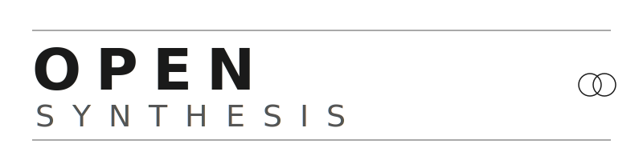

<p align="center">
  
</p>

<p align="center">
  <strong>RAG pipeline for synthesizing peer-reviewed scientific literature using open-source LLMs with directional ablation, deployed on private infrastructure.</strong>
</p>

[opensynthesis.dev](https://opensynthesis.dev)

---

## What This Does

Open Synthesis ingests peer-reviewed papers and government data from 31 public APIs, stores them in a vector database, and synthesizes answers to research questions using an open-weights LLM that has been processed with [Heretic](https://github.com/p-e-w/heretic) to remove refusal behavior. Every output is citation-grounded, validated for hallucinations, and tagged with a confidence level.

```
[CORPUS] → [RETRIEVAL] → [SYNTHESIS] → [VALIDATION]
 31 APIs    hybrid BM25    RunPod        citation check
 ChromaDB   + dense        GPU pod       hallucination detect
 embeddings reranking      ablated LLM   uncertainty scoring
```

## Model

The synthesis layer uses Llama 3.1 70B Instruct with directional ablation applied via [Heretic](https://github.com/p-e-w/heretic) to remove refusal behavior on scientific topics. We distribute only the [LoRA adapter](https://huggingface.co/opensynthesis/Llama-3.1-70B-heretic-lora) — users must download the base model under Meta's Llama 3.1 Community License and merge locally.

### Ablation Results

| Metric | Value |
|---|---|
| Base model | `meta-llama/Llama-3.1-70B-Instruct` (Llama 3.1 Community License) |
| LoRA adapter | [`opensynthesis/Llama-3.1-70B-heretic-lora`](https://huggingface.co/opensynthesis/Llama-3.1-70B-heretic-lora) |
| Architecture | `LlamaForCausalLM` |
| Parameters | 70B |
| Method | Heretic directional ablation (Arditi et al., 2024) |
| Optimization | 200 Optuna TPE trials (8/100 refusals, KL 0.0927) |
| Context window | 128K tokens (native, fully usable) |
| Serving | Merge + AWQ 4-bit, tensor parallel across 2x A100 80GB |
| Recommended GPU | 2x A100 80GB ($2.38/hr on RunPod) |

The previous production model was [`opensynthesis/Qwen3-14B-heretic`](https://huggingface.co/opensynthesis/Qwen3-14B-heretic) (3/100 refusals, KL ~5e-8). The upgrade to 70B provides native 128K context (vs 32K serving limit) and substantially stronger reasoning for dense, multi-source synthesis.

See [model_card.md](model_card.md) for full model selection rationale and [runpod_deployment.md](runpod_deployment.md) for deployment guide.

## Quickstart

```bash
# Install with uv
uv sync

# List available data sources
open-synthesis sources

# Ingest papers on a topic
open-synthesis ingest "psilocybin depression" --domain psychopharm --sources semantic_scholar,pubmed

# Run a synthesis (requires RunPod GPU pod running vLLM)
# Option 1: SSH tunnel (recommended)
ssh -i ~/.ssh/runpod_ed25519 -f -N -L 8000:localhost:8000 -p <SSH_PORT> root@<POD_IP>
export RUNPOD_BASE_URL="http://localhost:8000"

# Option 2: RunPod proxy
export RUNPOD_POD_ID="your-pod-id"

open-synthesis synthesize "What is the evidence for psilocybin as a treatment for major depressive disorder?" --domain psychopharm

# Generate a multi-section research paper
open-synthesis paper "Comprehensive review of the heritability of intelligence" --domain behavioral_genetics --output paper.md
```

## Architecture

### Four Layers

1. **Corpus** — Ingest from 31 public APIs across literature, preprints, biomedical, chemical, and statistical data sources. Documents are chunked at paragraph level and embedded with `all-MiniLM-L6-v2` into ChromaDB.

2. **Retrieval** — Hybrid search combining dense vector similarity and BM25 keyword matching via reciprocal rank fusion. Cross-encoder reranking placeholder for production use.

3. **Synthesis** — Research questions are sent with retrieved context to an ablated open-weights LLM running on RunPod via vLLM. The model produces inline-cited synthesis with falsifiability criteria.

4. **Validation** — Three-pass validation: citation verification (are claims supported by cited sources?), hallucination detection (fabricated stats, names, or overstatements?), and uncertainty quantification (well-supported / limited / contested / insufficient).

### Deployment

Deploy on a RunPod GPU pod with [vLLM](https://github.com/vllm-project/vllm). Merge the LoRA adapter into the base model, quantize to AWQ, and serve:

```bash
# On a RunPod GPU pod (2x A100 80GB, ~$2.38/hr):
pip install vllm peft autoawq
# See runpod_deployment.md for full merge + quantize + serve instructions
vllm serve /workspace/Llama-3.1-70B-heretic-AWQ \
  --quantization awq --max-model-len 131072 --tensor-parallel-size 2
```

See [runpod_deployment.md](runpod_deployment.md) for full setup, known issues, and model selection.

## Configuration

Copy `config/default.toml` and customize:

```toml
vector_store_path = "./vectorstore"

[inference]
temperature = 0.3
max_new_tokens = 16384

[retrieval]
n_results = 20
dense_weight = 0.6
sparse_weight = 0.4
```

Or use environment variables with `RUNPOD_` prefix for RunPod settings, `OSYN_` prefix for general settings.

## Data Sources

See [DATA_SOURCES.md](DATA_SOURCES.md) for complete API documentation, auth requirements, and rate limits.

Sources requiring API keys: **CORE**, **Census**, **FRED**, **Springer Nature**. All others work without authentication (27 of 31 need no auth).

## Project Structure

```
src/open_synthesis/
├── cli.py              # Typer CLI (ingest, synthesize, paper, validate, sources)
├── config.py           # Pydantic settings + TOML loader
├── types.py            # Domain models (Document, Chunk, SynthesisResult)
├── corpus/             # Ingestion layer
│   ├── base.py         # DataSource ABC
│   ├── manager.py      # Orchestrator (search → dedupe → chunk → embed → store)
│   ├── chunker.py      # Paragraph-level text splitting
│   ├── store.py        # ChromaDB wrapper
│   └── sources/        # 31 API integrations
├── retrieval/          # Hybrid retrieval
│   ├── dense.py        # Sentence-transformer vector search
│   ├── sparse.py       # BM25 keyword search
│   ├── hybrid.py       # Reciprocal rank fusion
│   └── reranker.py     # Cross-encoder placeholder
├── synthesis/          # LLM inference
│   ├── client.py       # RunPod API client
│   ├── prompts.py      # Template loader
│   ├── pipeline.py     # End-to-end orchestration
│   └── paper.py        # Multi-section paper pipeline
├── validation/         # Output verification
│   ├── citation.py     # Citation check parsing
│   ├── hallucination.py # Hallucination flag parsing
│   └── uncertainty.py  # Confidence level assessment
└── handler.py          # RunPod serverless handler (self-contained)
```

## Development

```bash
uv sync --extra dev
pytest
```

## Documentation

- [WHITEPAPER.md](WHITEPAPER.md) — Full technical paper (Parts I–VII)
- [model_card.md](model_card.md) — Model selection guide and ablation metrics
- [runpod_deployment.md](runpod_deployment.md) — Deployment pipeline with reference code
- [DATA_SOURCES.md](DATA_SOURCES.md) — API documentation for all 31 data sources
- [REFERENCES.md](REFERENCES.md) — Bibliography

## License

MIT
